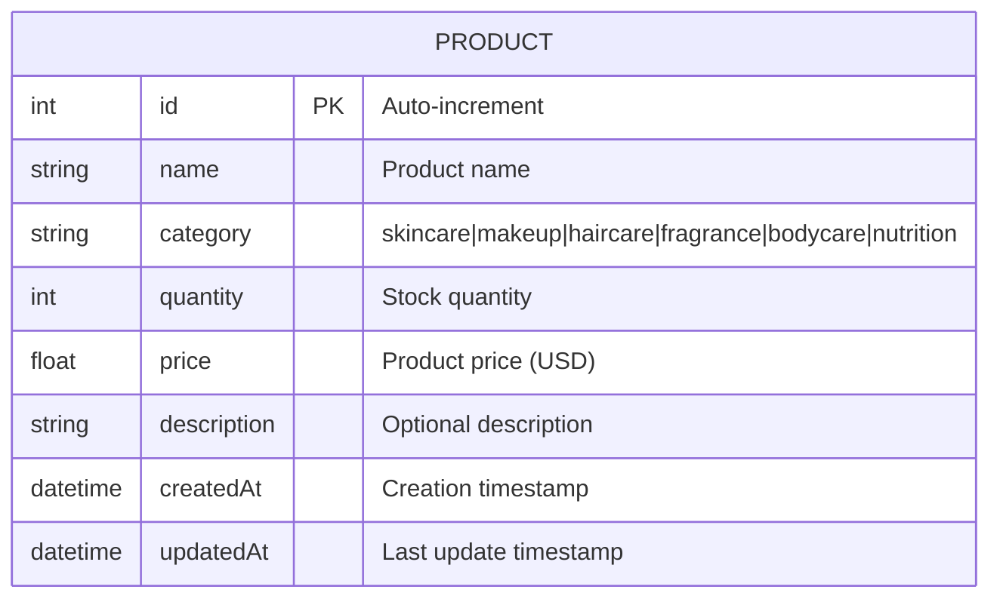

# Database Schema - Farmasi Inventory

## Entity Relationship Diagram



## Database: PostgreSQL (Production) / SQLite (Local Dev)

### Table: `products`

| Column | Type | Constraints | Description |
|--------|------|-------------|-------------|
| `id` | INTEGER | PRIMARY KEY, AUTO INCREMENT | Unique product identifier |
| `name` | VARCHAR | NOT NULL | Product name |
| `category` | VARCHAR | NOT NULL, INDEXED | Product category |
| `quantity` | INTEGER | NOT NULL, DEFAULT 0, INDEXED | Stock quantity |
| `price` | DECIMAL(10,2) | NOT NULL | Product price |
| `description` | TEXT | NULLABLE | Product description |
| `createdAt` | TIMESTAMP | NOT NULL, DEFAULT NOW() | Creation date |
| `updatedAt` | TIMESTAMP | NOT NULL, AUTO UPDATE | Last modification date |

### Indexes

- `category` - Fast category filtering
- `quantity` - Fast low-stock queries

### Categories

- `skincare` - Skin care products
- `makeup` - Makeup products
- `haircare` - Hair care products
- `fragrance` - Perfumes and fragrances
- `bodycare` - Body care products
- `nutrition` - Nutritional supplements

## Sample Data

Current database contains 10 Farmasi products with realistic inventory data.

## Connection Info

**Production (Render):**
- Database: PostgreSQL 18
- Host: Render Cloud
- Connection: Managed via Prisma

**Development (Local):**
- Database: SQLite
- File: `prisma/dev.db`
- Tool: Prisma Studio (port 5555)

## Prisma Commands

```bash
# View data visually
npx prisma studio

# Generate ERD diagram
npx prisma generate

# Apply migrations
npx prisma migrate deploy

# Seed database
node prisma/seed.js
```
